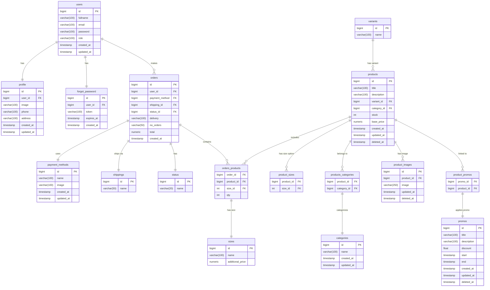

# ERD COFFEE SHOP

```mermaid
erDiagram


users { 
    bigint id PK
    varchar(100) fullname
    varchar(100) email
    varchar(100) password
    varchar(100) role
    timestamp created_at
    timestamp updated_at
}

profile {
    bigint id PK
    bigint user_id FK
    varchar(100) image
    varchar(100) phone
    varchar(100) address
    timestamp created_at
    timestamp updated_at
}

forgot_password {
    bigint id PK
    bigint user_id FK
    varchar(100) token
    timestamp expires_at
    timestamp created_at
}

variants {
    bigint id PK
    varchar(100) name
}

categories {
    bigint id PK
    varchar(100) name
    timestamp created_at
    timestamp updated_at
}

sizes {
    bigint id PK
    varchar(100) name
    numeric additional_price
}

products {
    bigint id PK
    varchar(100) title
    varchar(100) description
    bigint variant_id FK
    bigint category_id FK
    int stock
    numeric base_price
    timestamp created_at
    timestamp updated_at
    timestamp deleted_at
}

products_categories {
    bigint product_id FK
    bigint category_id FK
}

product_images {
    bigint id PK
    bigint product_id FK
    varchar(250) image
    timestamp updated_at
    timestamp deleted_at
}

promos {
    bigint id PK
    varchar(100) title
    varchar(100) description
    float discount
    timestamp start
    timestamp end
    timestamp created_at
    timestamp updated_at
    timestamp deleted_at
}

product_promos {
    bigint promo_id FK
    bigint product_id FK
}

payment_methods {
    bigint id PK
    varchar(100) name
    varchar(100) image
    timestamp created_at
    timestamp updated_at
}

shippings {
    bigint id PK
    varchar(50) name
}

status {
    bigint id PK
    varchar(20) name
}

orders {
    bigint id PK
    bigint user_id FK
    bigint payment_method FK
    bigint shipping_id FK
    bigint status_id FK
    varchar(100) delivery
    varchar(50) no_orders
    numeric total
    timestamp created_at
}

orders_products {
    bigint order_id FK
    bigint product_id FK
    int size_id FK
    int qty
}

product_sizes {
    bigint product_id FK
    int size_id FK
}

users ||--|| profile : "has"
users ||--|| forgot_password : "has"
users ||--o{ orders : "makes"

orders ||--|| payment_methods : "uses"
orders ||--|| shippings : "ships via"
orders ||--|| status : "has"
orders ||--o{ orders_products : "contains"

orders_products ||--|| sizes : "has size"
products ||--o{ orders_products : "includes"
products ||--o{ product_sizes : "has size option"

products ||--o{ products_categories : "belongs to"
products_categories ||--|| categories : "categorizes"

products ||--o{ product_images : "has image"
products ||--o{ product_promos : "linked to"
product_promos ||--|| promos : "applies promo"

variants ||--o{ products : "has variant"


```
